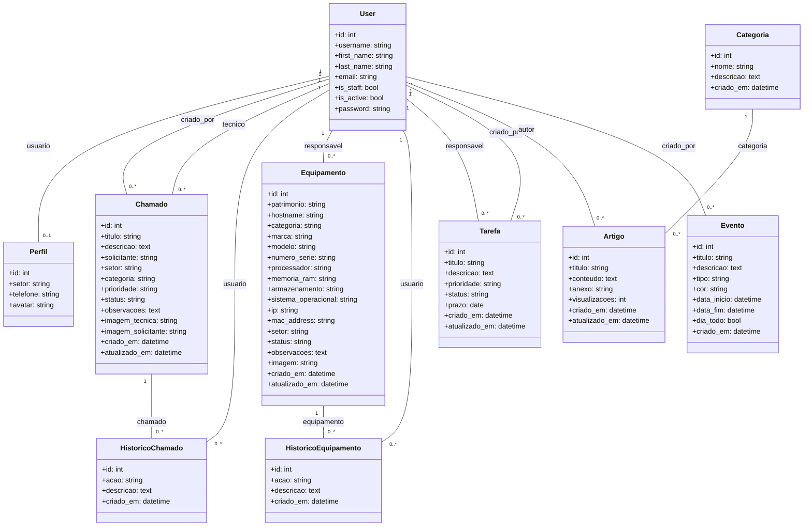
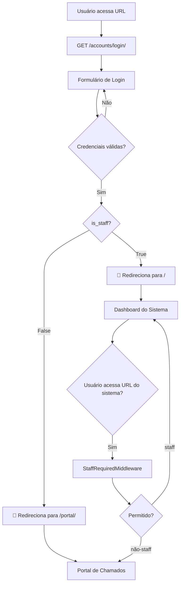
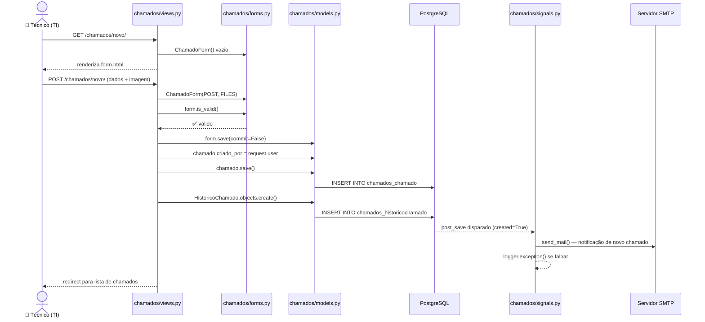
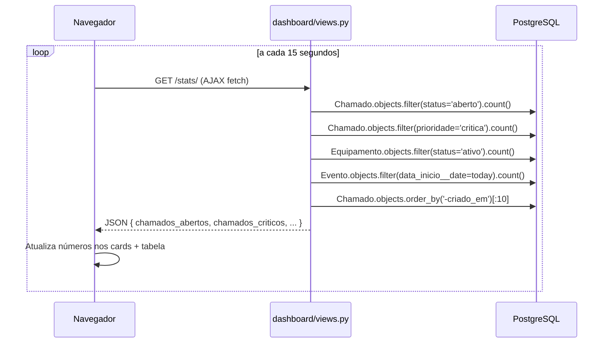
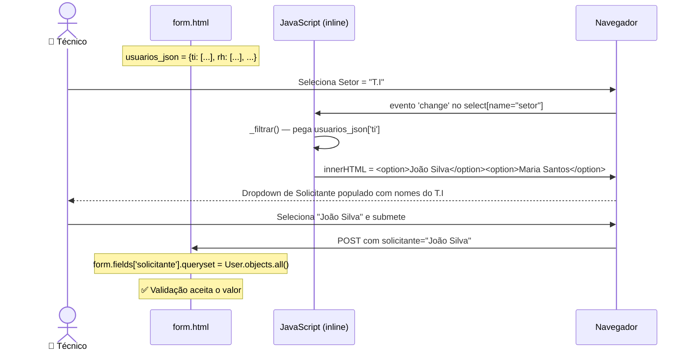
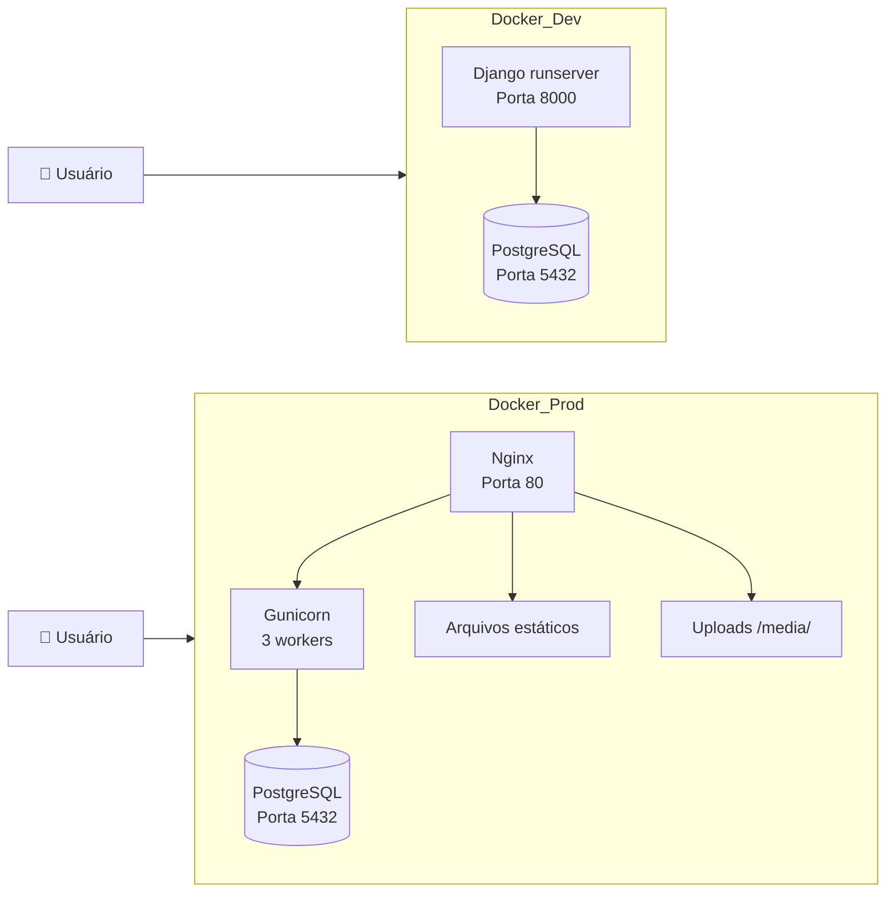
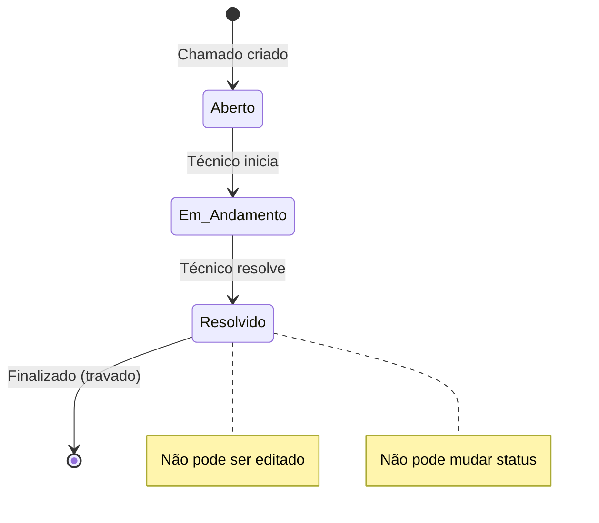

# 📐 Diagrama UML — ABM TI

> Para visualizar: abra este arquivo no [GitHub](https://github.com/rbrafazin/sistema_chamados_ti) ou cole o código em [mermaid.live](https://mermaid.live)

---

## 1. Diagrama de Classes

---

## 2. Diagrama de Acesso (Login → Sistema ou Portal)

---

## 3. Diagrama de Sequência — Criar Chamado

---

## 4. Diagrama de Sequência — Auto-Refresh (Dashboard)

---

## 5. Diagrama de Sequência — Filtro Dinâmico (Solicitante por Setor)

---

## 6. Diagrama de Componentes (Arquitetura Física)

---

## 7. Diagrama de Estados — Status do Chamado

---

**Como visualizar estes diagramas:**
1. Abra este arquivo `.md` no GitHub — renderiza automaticamente
2. Ou cole o código em https://mermaid.live
3. Ou instale o plugin "Markdown Preview Mermaid" no VS Code
